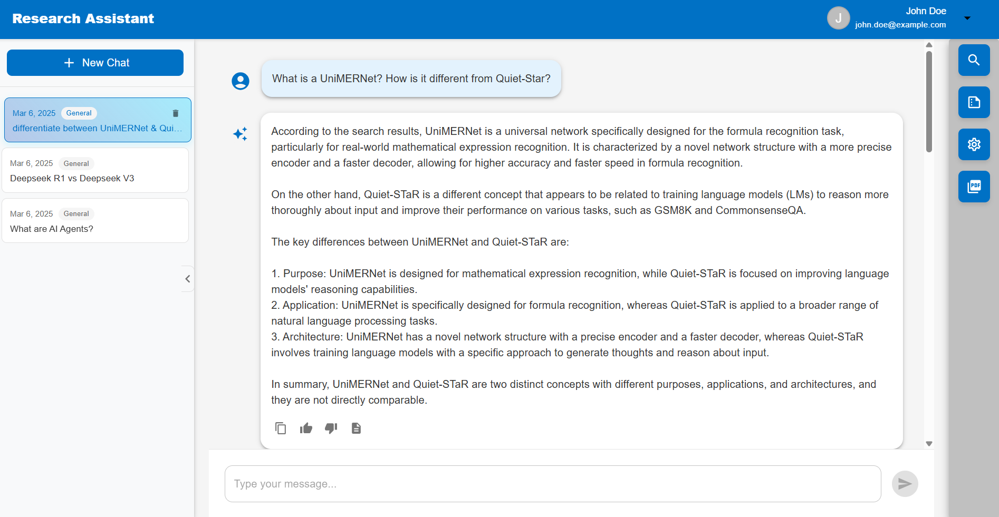

# AI Agents Framework
------------------------------------------

# RAG Chatbot for Researchers

This repository provides a comprehensive framework for building a Retrieval-Augmented Generation (RAG) chatbot specifically designed for researchers. This framework combines various components to create a powerful system that can retrieve relevant information from documents and generate accurate, contextually appropriate responses.


|   |   |
| ----------------------------------- | ----------------------------------- |
|  |  |
|  |  |


## How is RAG Implemented?

RAG combines retrieval systems with large language models to generate more accurate and relevant responses by incorporating external knowledge.


### Key Components:
- **Dataprep Component**:  The framework includes a dataprep component that processes input documents, breaking them into manageable chunks that can be embedded and indexed.
- **Embedding Service**: Documents are transformed into vector representations using embedding models like `BAAI/bge-base-en-v1.5` which captures the semantic meaning of text.
- **Vector Storage**: These embeddings are stored in a `Redis` vector database, allowing for efficient similarity searches.
- **Retriever Component**: When a user asks a question, the retriever component finds the most relevant document chunks by comparing the query embedding with the stored document embeddings.
- **Reranker Component**: Retrieved documents are further refined through a reranking process using models like `BAAI/bge-reranker-base` to ensure the most relevant context is provided to the LLM.
- **LLM Backend**: The LLM (either via `vLLM` or `Groq`) generates responses based on the retrieved context and the user's query.
- **Audio Component**:  Transcribes audio input into text, enabling voice interaction with the RAG system. Uses OpenAI's `Whisper base` model. 
- **Frontend UI**: User interface to interact with the chatbot.

This architecture allows real-time information integration and better response quality by combining search capabilities with generative models.

Each service is **containerized** for modularity and scalability.

---


## vLLM vs Groq for model serving:
The repository offers two options for the LLM serving component: Groq and vLLM.
- **vLLM** is an open-source high-performance inference engine for large language models.
- **Groq** is a proprietary inference engine designed for ultra-fast response times using specialized hardware.


Groq is recommended for running the application on personal computers as Groq's API-based approach does **NOT** require running the LLM locally, making it much less resource-intensive for personal computers that may not have powerful GPUs. Additionally using Groq requires only an **API key** rather than setting up a complex local inference environment.

The vLLM option is more suitable for server deployments with dedicated GPU resources where running models locally might be preferred for reasons like data privacy.

---

## Instructions for application setup:
### Build images for all services

1. [Build dataprep component](./comps/dataprep/README.md)
2. [Build retriever component](./comps/retriever/README.md)
3. [Build backend component](./comps/README.md)
4. [Build Whisper component](./comps/whisper/README.md)
5. [Build UI component](./design-patterns/rag/README.md)
6. [Build vLLM image](./comps/README.vllm.md)
7. [Build Groq component](./comps/groq/README.md)

```
export no_proxy="127.0.0.1,localhost,dataprep-redis,tei-embedding-service,retriever,tei-reranking-service,backend,mongodb,vllm-service,whisper-service,groq-service"
export EMBEDDING_MODEL_ID="BAAI/bge-base-en-v1.5"
export RERANK_MODEL_ID="BAAI/bge-reranker-base"
export LLM_MODEL_ID="meta-llama/Llama-3.1-8B-Instruct"
export REDIS_URL="redis://redis-vector-db:6379"
export INDEX_NAME="rag-redis"
export EMBEDDING_SERVER_HOST_IP=tei-embedding-service
export EMBEDDING_SERVER_PORT=80
export RETRIEVER_SERVICE_HOST_IP=retriever
export RETRIEVER_SERVICE_PORT=7000 
export RERANK_SERVER_HOST_IP=tei-reranking-service
export RERANK_SERVER_PORT=80
export WHISPER_SERVICE_HOST_IP=whisper-service
export WHISPER_SERVICE_PORT=8765
export LLM_SERVER_HOST_IP=vllm-service
export LLM_SERVER_PORT=8000
export MONGO_HOST=mongodb
export MEGA_SERVICE_PORT=5008
export SERVER_HOST_URL="localhost:$MEGA_SERVICE_PORT"
export NEXT_PUBLIC_SERVER_URL=$SERVER_HOST_URL
export HUGGINGFACEHUB_API_TOKEN=${HUGGINGFACEHUB_API_TOKEN}
export DATAPREP_OUT_DIR=</path/to/dataprep/out/dir>
export HF_CACHE=</path/to/hf_cache/dir>

```
> Note: host would be localhost for local dev or server hostname for remote server

### Groq Serving (Recommended for PC): 
```
export LLM_SERVER_HOST_IP=groq-service
export LLM_SERVER_PORT=8000
export GROQ_MODEL=llama-3.3-70b-versatile
export GROQ_API_KEY=${GROQ_API_KEY}

docker compose -f install/docker/docker-compose-groq.yaml up
```

### vLLM Serving (Not required for PC development):
```
export SERVER_HOST_IP=vllm-service
export LLM_SERVER_HOST_IP=vllm-service
export LLM_SERVER_PORT=8000

docker compose -f install/docker/research-assistant/docker-compose.yaml up
```

The application will be available on `http://localhost:5009`

## References

- [OPEA components repository](https://github.com/opea-project/GenAIComps)
- [OPEA examples repository](https://github.com/opea-project/GenAIExamples)
- [vLLM](https://github.com/vllm-project/vllm)


## Setup

### Run all services

1. [Build dataprep component](./comps/dataprep/README.md)
2. [Build retriever component](./comps/retriever/README.md)
3. [Build backend component](./comps/README.md)
4. [Build groq component](./comps/groq/README.md)
5. [Build ui component](./design-patterns/rag/README.md)

```

```


> Note: host would be localhost for local dev or server hostname for remote server


